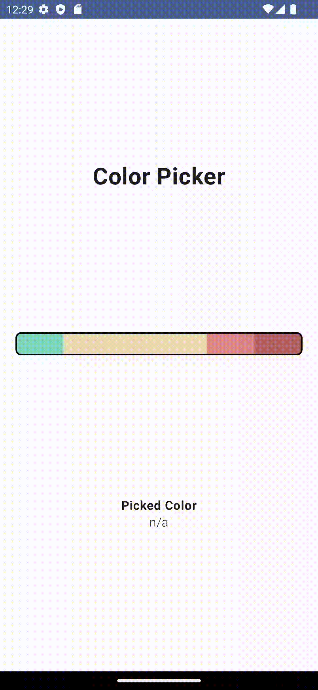
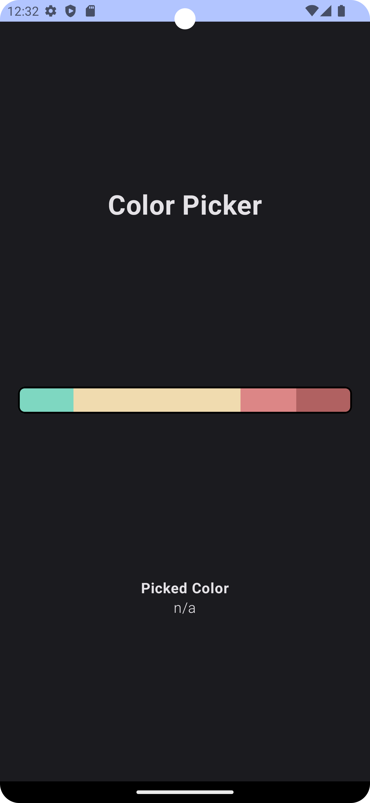

# Color Picker Widget

## Setup
* initialize a project in Android Studio
* use [git](https://git-scm.com/) or any other version tool to publish your code
* you can publish your code in [Github](https://github.com/) or some platform of your choice
* to solve this task you can either use Android with View System or Jetpack Compose

## Goal
* create a **widget** that is able to show a **list** of **colors horizontally**
	* the **color list** is provided by a constant variable as part of your project (e.g. ```val colors = ...```)
	* the **color format** can be [hex](https://www.w3schools.com/css/css_colors_hex.asp) or some predefined [color names](https://www.w3schools.com/css/css_colors.asp)
	* each **color** can **vary** in its shown **width**.

**example**
Color 1 width = 100
Color 2 width = 200
Result: Color 1 gets 1/3 of the space and Color 2 gets 2/3 of the space.
* the user is able to click a color and gets an indication what hex this color is
* provide a second theme that makes the background dark and the text white


## Hints
* the widget should be seen if the project is started
* **documentation** and **testing** will help us to understand your code
* consider the widget to be used **multiple times** within this fantasy project.
    * it is okay to only use the widget in the ```MainActivity.kt```

## Sample Widget
|  |  |
| --------------------------------------- | --------------------------------------- |
