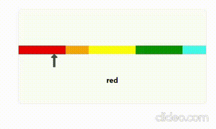

# Color Indicator Widget

## Setup
* Initialize a project with a frontend framework (Angular, React, Vue)

## Goal
* Create a widget that is able to show a list of colors horizontally
  * The color list is provided by a constant variable as part of your project (e.g. ```const colors = ...```)
  * The color format can be [hex](https://www.w3schools.com/css/css_colors_hex.asp) or some predefined [color names](https://www.w3schools.com/css/css_colors.asp)
  * Each color can vary in its shown width
* The user is able to move an indicator around that indicates a color
* The user has printed out the color that is currently indicated

## Hints
* The widget should be seen if the project is started
* Documentation and testing will help us to understand your code
* Consider the widget to be used multiple times within this fantasy project
* node_modules can be installed locally on each pc and are not needed to be shipped :)

## Sample Widget

